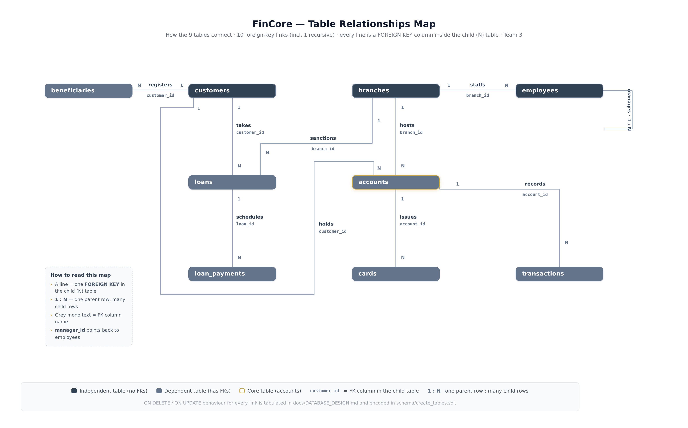
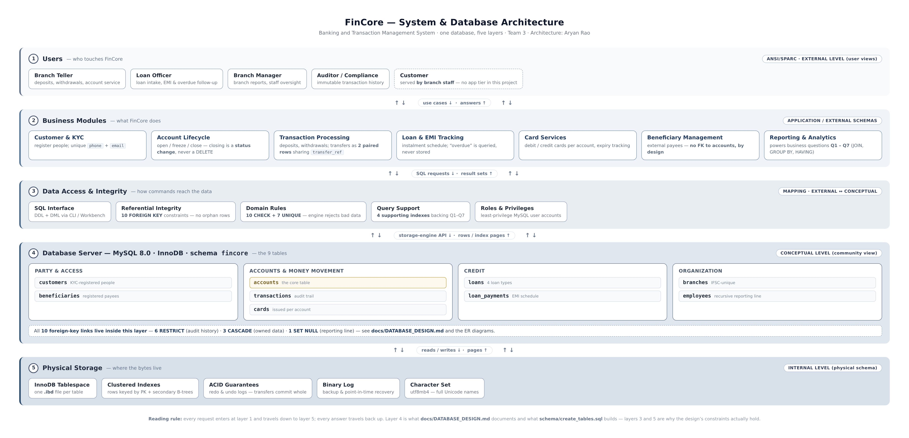
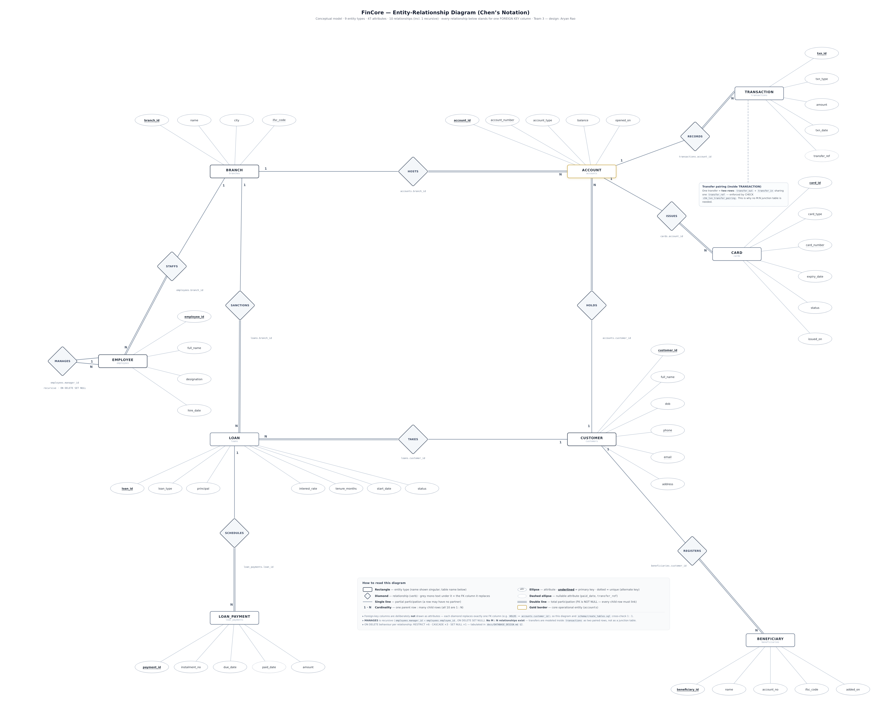
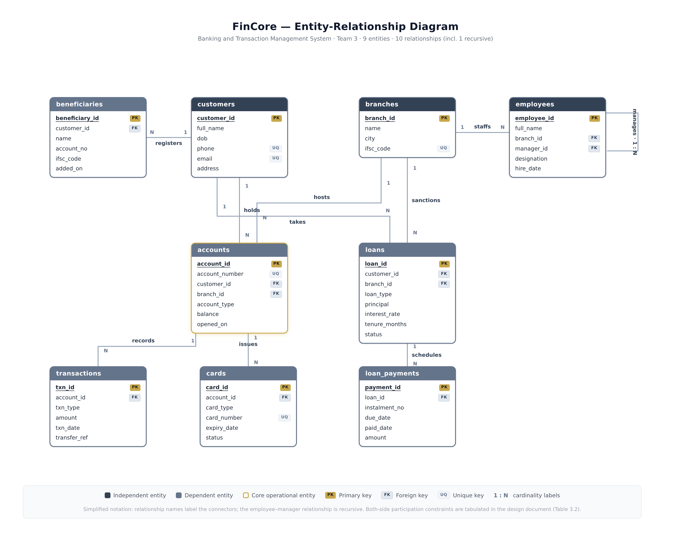
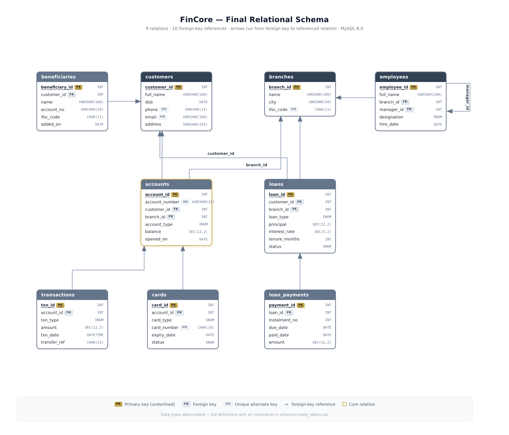
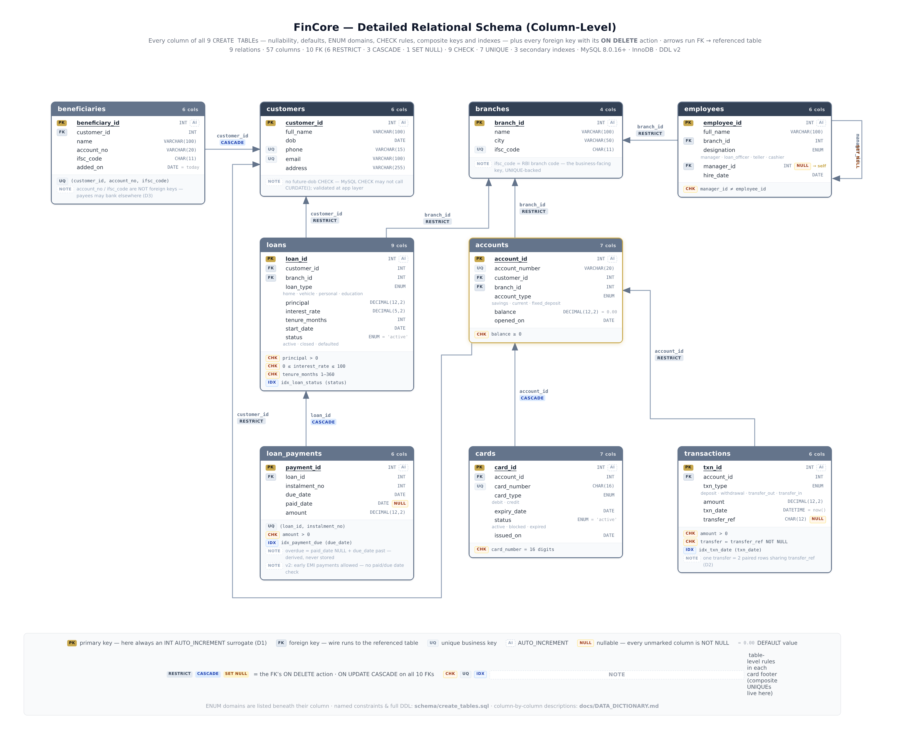

<div align="center">

# 🏦 FinCore

**Banking & Transaction Management Database**

A DBMS course project · Team 3 · Atria University

[](https://dev.mysql.com/doc/)
[](https://dev.mysql.com/doc/)
[](#7--the-schema-at-a-glance)
[](docs/DATA_DICTIONARY.md)
[](schema/create_tables.sql)
[](#14--how-the-design-was-verified)
[](data/insert_data.sql)
[](docs/NORMALIZATION.md)
[](#1--project-status)

Database design & DDL: **Aryan Rao** (AU25UG-006) · Design review: **Amruta Nagavi** · Implementation runs: **Ganga Siva Kumar Reddy** · Seed data: **Harsita** (AU25UG-019)

</div>

---

FinCore is a MySQL database for a small retail bank: branches and the staff who run them, KYC-registered customers and the accounts they hold, a full record of every deposit, withdrawal and transfer, a lending side with EMI instalment schedules, and the payment rails on top — cards, and registered payees who may bank anywhere in India.

We built it following two simple rules:

- **If MySQL can enforce a rule, the rule goes in the database.** 34 named constraints and 2 triggers in the DDL — CHECKs, foreign keys, UNIQUE keys, triggers — not checks in application code that somebody could forget to call.
- **Write down every decision, including the ones we rejected.** The docs in this repo explain why the schema looks the way it does, so a reader can check our reasoning instead of taking our word for it.

All nine tables are in BCNF, and the full working (not just the verdict) is in [`docs/NORMALIZATION.md`](docs/NORMALIZATION.md) — which also *executes* the proof as SQL ([`queries/normalization_proof.sql`](queries/normalization_proof.sql), results in that doc's §9).

> ℹ️ **Status:** the design, docs, diagrams, the DDL bring-up (Ganga), the seed (Harsita, v1.1) and the normalization proof are done — and so are Q1–Q7 of the business query set: everyone's questions are in `queries/query.sql`, the answers in [`docs/ANSWERS.md`](docs/ANSWERS.md). Remaining: Aryan's Q8–Q10, the result screenshots, the test-case sheets and the report — when they land, this README gets its final update. Details in [§1 · Project status](#1--project-status).



*All 9 tables and all 10 foreign-key links — [each of the six diagrams is explained in detail in §4](#4--the-diagrams-explained).*

---

## Contents

1. [Project status](#1--project-status)
2. [What FinCore is](#2--what-fincore-is)
3. [How to go through this repo](#3--how-to-go-through-this-repo)
4. [The diagrams, explained](#4--the-diagrams-explained)
5. [What this repository demonstrates](#5--what-this-repository-demonstrates)
6. [Repository map](#6--repository-map)
7. [The schema at a glance](#7--the-schema-at-a-glance)
8. [The ten relationships](#8--the-ten-relationships)
9. [Design decisions (D1–D6)](#9--design-decisions-d1d6)
10. [Normalization](#10--normalization)
11. [Running it](#11--running-it)
12. [Try to break it](#12--try-to-break-it)
13. [The questions it answers](#13--the-questions-it-answers)
14. [How the design was verified](#14--how-the-design-was-verified)
15. [Scope, limits and next steps](#15--scope-limits-and-next-steps)
16. [Team and contributions](#16--team-and-contributions)
17. [References](#17--references)

## 1. 📌 Project status

Keeping this near the top so it's easy to see where things stand. The design side is complete and cross-checked, the DDL now runs verified on a live server, the seed is loaded and reproducible, and Q1–Q7 of the query set are done — what remains is the closing work: Aryan's Q8–Q10, the result screenshots, the test-case sheets and the report, per the split in [§16](#16--team-and-contributions).

| Part | Owner | Status |
|---|---|---|
| Schema design + DDL ([`schema/create_tables.sql`](schema/create_tables.sql)) | Aryan | ✅ done |
| Design docs — [design write-up](docs/DATABASE_DESIGN.md), [normalization proof](docs/NORMALIZATION.md), [data dictionary](docs/DATA_DICTIONARY.md) | Aryan | ✅ done |
| Diagrams (6, in [`diagrams/`](diagrams)) | Aryan | ✅ done |
| Design review pass (produced DDL v2 — see [§14](#14--how-the-design-was-verified)) | Amruta | ✅ done |
| Bringing the DDL up on MySQL + verification runs — the v2.1 trigger fix ([§14](#14--how-the-design-was-verified)) | Ganga | ✅ done |
| Normalization proof executed as SQL + result screenshots ([§10](#10--normalization)) | Aryan | ✅ done |
| Seed / demo data — [`data/insert_data.sql`](data/insert_data.sql) v1.1 (3,242 rows) | Harsita | ✅ done |
| Business query set — **Q1–Q7 done**, in `queries/query.sql` (Q1 **Harsita** · Q2 & Q7 **Thanmiksha** · Q3 & Q6 **Jashan** · Q4 **Ganga** · Q5 **Amruta**); Q8–Q10 remain (**Aryan**) — screenshot slots in [§13.1](#131-the-curated-set--who-did-what-and-where-the-screenshots-go) | everyone → Aryan | ⏳ Q8–Q10 |
| Test cases (10 each) | Thanmiksha, Jashan | ⏳ in progress |
| Project report | Thanmiksha, Amruta | ⏳ in progress |
| Final README + docs update | everyone | 📋 after the above |

Once the remaining ⏳ rows — Q8–Q10, the screenshots, the test-case sheets and the report — are done, this table (and the rest of this README) gets its final update and the status badge at the top flips to *complete*.

## 2. 🏦 What FinCore is

The system models one small bank end-to-end. On the **master-data** side sit `branches`, `customers` and `employees` — the things that exist in their own right. On the **operations** side, `accounts` is the hub: every operational table either points at it or points at something that points at it. Around the hub sit five satellites, one per business area: `transactions` (money movement), `loans` + `loan_payments` (lending and EMI schedules), `cards` (payment instruments issued on an account) and `beneficiaries` (a customer's registered payees — who may hold accounts at *other* banks, which is why that table is designed a bit differently; see D3 in [§9](#9--design-decisions-d1d6)).

Before drawing a single box, we fixed five ground rules and stuck to them. They explain most of what follows:

1. **Rules go in the database where possible.** Negative balances, zero-amount movements, self-managing employees and malformed card numbers are rejected by CHECK constraints, ENUMs and triggers — not by app code that somebody could bypass.
2. **Don't delete history.** Deleting anything with financial history attached is blocked by the referential actions in [§8](#8--the-ten-relationships).
3. **Don't store what you can derive.** There is no `is_overdue`, no `age`, no `outstanding_amount` column anywhere — truths that change with the calendar are computed at query time, so the data can never contradict itself.
4. **Money is exact.** `DECIMAL(12,2)` everywhere, never `FLOAT`, because binary fractions cannot represent ten paise exactly.
5. **Write down why.** For each decision, the alternatives we considered and rejected are recorded in the design doc, so the reasoning can be checked rather than trusted.

The full write-up of these rules and the "why exactly these nine tables" reasoning is in [`docs/DATABASE_DESIGN.md`](docs/DATABASE_DESIGN.md) §1.

## 3. 🧭 How to go through this repo

**The 10-minute pass** — read §2 above and [§7](#7--the-schema-at-a-glance) (what the system is, how the schema is shaped), look through the diagrams in [§4](#4--the-diagrams-explained), then read [§8](#8--the-ten-relationships) (the ten relationships and the policy behind them). If a terminal with MySQL is at hand, run the script ([§11](#11--running-it)) and try the negative tests ([§12](#12--try-to-break-it)) — watching MySQL reject bad rows is a quick way to see the design is real.

**The ~45-minute pass**

| Step | Read / do | Time |
|---|---|---|
| 1 | This README, §2–§10 | 10 min |
| 2 | [`docs/DATABASE_DESIGN.md`](docs/DATABASE_DESIGN.md) — goals (§1), relationships (§2), decisions with rejected alternatives (§5) | 10 min |
| 3 | [`docs/NORMALIZATION.md`](docs/NORMALIZATION.md) — the 1NF → BCNF working and the FD-by-FD proof | 10 min |
| 4 | [`schema/create_tables.sql`](schema/create_tables.sql) — the DDL; every constraint carries its reasoning in a comment | 5 min |
| 5 | Run it and probe it — [§11](#11--running-it) and [§12](#12--try-to-break-it) | 10 min |
| 6 | [`docs/DATA_DICTIONARY.md`](docs/DATA_DICTIONARY.md) — reference; consult as needed | — |

[§5](#5--what-this-repository-demonstrates) maps each course topic to where the evidence for it lives, so any line of the marking scheme can be traced straight to an artifact.

## 4. 🎨 The diagrams, explained

All six diagrams live in [`diagrams/`](diagrams). They show the same database at six levels of detail, roughly in the order we made them — architecture first, then the conceptual ER model, then progressively more physical views. On GitHub, click any image to view it full-size.

### 4.1 System architecture — [`architecture_diagram.png`](diagrams/architecture_diagram.png)



The whole system in five layers, read top to bottom:

1. **Users** — branch teller, loan officer, branch manager, auditor. There is no app tier in this project; the database itself is the deliverable.
2. **Business modules** — customer & KYC, account lifecycle (closing an account is a *status change*, never a `DELETE`), transaction processing (transfers as two paired rows), loan & EMI tracking, card services, beneficiary management, and the reporting that powers the business questions.
3. **Data access & integrity** — the SQL interface, the 10 foreign keys, the CHECK + UNIQUE domain rules, the supporting indexes, and roles/privileges.
4. **Database server** — MySQL 8.0 / InnoDB, schema `fincore`, with the nine tables grouped into four domains: party & access, accounts & money movement, credit, and organization. All 10 FK links live inside this layer.
5. **Physical storage** — one `.ibd` file per table, clustered indexes on the primary keys, ACID guarantees from the redo/undo logs, the binary log for recovery, and `utf8mb4` storage.

The right edge of the diagram maps each layer to its **ANSI/SPARC level** (external → conceptual → internal) — the three-level architecture from class. The reading rule, written on the diagram itself: every request enters at layer 1 and travels down to layer 5; every answer travels back up.

### 4.2 Conceptual model, Chen's notation — [`er_diagram_chen.png`](diagrams/er_diagram_chen.png)



The conceptual model in the notation from class: **9 entity rectangles, 10 relationship diamonds, 47 attribute ovals**. How to read it:

- **Rectangle** = entity type; **diamond** = relationship (the grey mono text under a diamond is the FK column it stands for); **oval** = attribute.
- **Underlined attribute** = primary key · **dotted outline** = unique (alternate key) · **dashed oval** = nullable (`paid_date`, `transfer_ref`).
- **Double line** = total participation (the FK is `NOT NULL` — every child row must link); **single line** = partial participation.
- **1 · N** = cardinality; all ten relationships are 1 : N.
- **Gold border** = `accounts`, the core operational entity.

Two deliberate choices worth knowing: FK columns are **not** drawn as attributes — each diamond replaces exactly one FK column (e.g. `HOLDS` ⇒ `accounts.customer_id`), so the diagram cross-checks 1 : 1 against the DDL. And there are **no M : N relationships** — a transfer is modeled inside `transactions` as two paired rows sharing a `transfer_ref` (D2 in [§9](#9--design-decisions-d1d6)), not as a junction table. The recursive `MANAGES` diamond (`employees.manager_id → employees.employee_id`) is the only relationship that loops.

### 4.3 Simplified ER — [`er_diagram.png`](diagrams/er_diagram.png)



The same schema in a lighter style: one card per table listing its column names with PK / FK / UQ badges (but no data types), and connectors labelled with the relationship verbs — `REGISTERS`, `TAKES`, `HOLDS`, `HOSTS`, `SANCTIONS`, `STAFFS`, `MANAGES` (looping back to `employees`), `RECORDS`, `ISSUES`, `SCHEDULES` — with 1 : N markers on each link. Header colours tell you which tables are independent (dark — no FKs), dependent (grey — carry FKs) and core (gold border, `accounts`). This is the view to start with if the Chen diagram feels busy.

### 4.4 Table relationships map — [`table_relationships.png`](diagrams/table_relationships.png)


The most compact view: 9 name-only pills and 10 lines, each line labelled with the relationship verb **and** the FK column that carries it (`customer_id`, `branch_id`, `manager_id`, …) plus the 1 : N direction. `accounts` is highlighted in gold as the hub. This is the same image as the one at the top of this README — the quick front-page map of the schema.

### 4.5 Relational schema — [`relational_schema.png`](diagrams/relational_schema.png)



The ER → relational mapping result (design doc §4): every table drawn with **all its columns and their data types** (`INT`, `VARCHAR(100)`, `ENUM`, `DECIMAL(12,2)`, …), PK underlined, UQ badged, and an arrow running from each FK column to the primary key it references. The `employees` arrow curves back to itself for `manager_id`. Same colour code as §4.3 for independent / dependent / core tables.

### 4.6 Detailed schema, column level — [`relational_schema_detailed.png`](diagrams/relational_schema_detailed.png)



The same layout as §4.5, one level deeper — this is the diagram version of [`docs/DATA_DICTIONARY.md`](docs/DATA_DICTIONARY.md):

- every column shows its type, plus badges for `AUTO_INCREMENT`, nullable (`NULL` — every unmarked column is `NOT NULL`) and default values (`= 0.00`, `= now()`, …);
- ENUM domains are listed beneath their column (e.g. `loan_type`: home · vehicle · personal · education);
- each table card has a footer with its own rules as **CHK / UQ / IDX / NOTE** chips — including the v2 notes like *"early EMI payments allowed"*;
- FK wires carry **RESTRICT / CASCADE / SET NULL** chips showing that link's `ON DELETE` action (the policy in [§8](#8--the-ten-relationships)).

If you want to check a single column's definition without opening the DDL, this is the image to zoom into.

## 5. 📚 What this repository demonstrates

| Course topic | Where the evidence lives |
|---|---|
| Requirements → entities and relationships | §2 above; design doc §1–§2 |
| ER modelling, Chen's notation (conceptual view) | §4.2 above; design doc §3 |
| ER → relational mapping (logical view) | §4.3–§4.6 above; design doc §4 |
| Physical design — data types, ENUM, DECIMAL, CHAR vs VARCHAR | the DDL itself; dictionary §1–§9 |
| Referential integrity — FK policy with per-relationship actions | §8 below; dictionary §10 |
| Domain integrity — CHECK, UNIQUE, ENUM catalogs | §7 and §12; dictionary §11, §12, §14 |
| Normalization to BCNF, 4NF, 5NF — with proofs, not verdicts | §10 below; [`docs/NORMALIZATION.md`](docs/NORMALIZATION.md); executed: [`queries/normalization_proof.sql`](queries/normalization_proof.sql) |
| Query design — the schema exists to answer questions | §13 below; dictionary §15 |
| Indexing strategy | §7 (inventory row) and §14; dictionary §13 |
| System architecture, ANSI/SPARC mapping | §4.1 above; design doc §1 |
| Verification discipline and documentation | §11, §12, §14; the v2 design log in design doc §7 |

## 6. 📁 Repository map

```
FinCore/
├── README.md                        ← you are here
├── schema/
│   └── create_tables.sql            DDL v2.1 — 9 tables, 34 named constraints
│                                    + 2 triggers, 3 secondary indexes;
│                                    idempotent (re-runnable) — the reset
│                                    button between demos
├── data/
│   └── insert_data.sql              seed v1.1 — deterministic demo data:
│                                    3,242 rows, no RAND() (identical every
│                                    run), self-check block at the end
├── queries/
│   ├── query.sql                    the team's curated business queries —
│   │                                Q1–Q7 done (one owner each), Q8–Q10
│   │                                land with the final update; §13.1 maps
│   │                                each question to its result screenshot
│   ├── bonus_queries.sql            the three unique questions (§13.2):
│   │                                recursive CTE, RANK() window, Benford
│   │                                screen — expected results in comments
│   └── normalization_proof.sql      the §10 proof, executed: 11 checks
│                                    (1NF → BCNF), expected results in
│                                    comments next to every query
├── docs/
│   ├── ANSWERS.md                   the answers file: every question from
│   │                                §13 — the curated set, the three
│   │                                unique questions and the proof checks
│   │                                — with its exact expected result on
│   │                                the loaded seed
│   ├── DATABASE_DESIGN.md           the main write-up: goals, relationships,
│   │                                decisions D1–D6 with rejected alternatives,
│   │                                normalization summary, verification story
│   ├── NORMALIZATION.md             the full working: 1NF → 2NF → 3NF → BCNF
│   │                                progression, FD-by-FD proof for all 9
│   │                                relations, 4NF/5NF, documented deviations
│   │                                + §9: the proof executed as SQL, with a
│   │                                result screenshot per check
│   ├── screenshots/                 the 11 result screenshots (N1–N11) backing
│   │                                NORMALIZATION.md §9 — one per check
│   ├── screenshots/queries/         slots for the business-query results —
│   │                                q01–q10 plus the three bonus questions
│   │                                (the checklist lives in §13.1)
│   └── DATA_DICTIONARY.md           all 57 columns + design notes + the FK /
│                                    CHECK / UNIQUE / index / ENUM catalogs
└── diagrams/
    ├── architecture_diagram.png     5-layer system & database architecture (§4.1)
    ├── er_diagram_chen.png          ER in Chen's notation — conceptual view (§4.2)
    ├── er_diagram.png               simplified ER — names + PK/FK badges (§4.3)
    ├── table_relationships.png      the map at the top — 9 tables, 10 links (§4.4)
    ├── relational_schema.png        logical schema, columns + types + FK arrows (§4.5)
    └── relational_schema_detailed.png  column-level: defaults, ENUMs, CHECKs,
                                        indexes, ON DELETE chips (§4.6)
```

The three docs cross-reference each other instead of repeating themselves: the design doc holds the *reasoning*, the dictionary holds the *column-level facts*, the normalization doc holds the *proof* (argued in §1–§8, executed in §9) — and the DDL is what all of them are checked against. If the DDL ever changes, the docs, diagrams, seed and proof script are regenerated with it (the sync contract in [§14](#14--how-the-design-was-verified)).

## 7. 📊 The schema at a glance

| Inventory | Value |
|---|---|
| Relations | 9 |
| Columns | 57 |
| Primary keys | 9 — all surrogate `AUTO_INCREMENT` integers (decision D1) |
| Foreign keys | 10 — **6 RESTRICT · 3 CASCADE · 1 SET NULL** (all `ON UPDATE CASCADE`) |
| CHECK constraints | 8 — violations fail with MySQL error **3819** |
| Triggers | 2 — `trg_emp_not_own_manager_ins` / `_upd`; violations fail with **1644** (v2.1, see [§14](#14--how-the-design-was-verified)) |
| UNIQUE keys | 7 — 5 single-column, 2 composite |
| ENUM domains | 7 — frozen business vocabularies (account type, txn type, …) |
| Secondary indexes | 3 — `idx_txn_date`, `idx_loan_status`, `idx_payment_due` |
| Storage engine / charset | InnoDB · `utf8mb4` (`utf8mb4_0900_ai_ci`) |
| Server floor | **MySQL 8.0.16+** — see [§11](#11--running-it) for why this is a hard requirement |
| Normal form | **BCNF on all 9 relations; 4NF and 5NF argued** ([§10](#10--normalization)) |

The nine tables, what one row in each means, and the keys that govern it:

| Table | One row is… | Keys and notable rules |
|---|---|---|
| `branches` | one physical branch | PK `branch_id` · UNIQUE `ifsc_code` |
| `customers` | one KYC-registered person | PK `customer_id` · UNIQUE `phone`, `email` — de-duplication keys |
| `accounts` | one deposit account — **the hub** | PK `account_id` · UNIQUE `account_number` · FKs → customers, branches · `balance >= 0` (CHECK) |
| `transactions` | one money movement, append-only | PK `txn_id` · FK → accounts (RESTRICT) · `amount > 0` and transfer-pairing (CHECKs) |
| `loans` | one sanctioned loan | PK `loan_id` · FKs → customers, branches · principal/rate/tenure bounds (CHECKs) |
| `loan_payments` | one scheduled EMI of one loan | PK `payment_id` · UNIQUE `(loan_id, instalment_no)` · FK → loans (CASCADE) |
| `employees` | one staff member | PK `employee_id` · FKs → branches, **employees (self, SET NULL)** · nobody manages themselves (2 triggers, v2.1) |
| `beneficiaries` | one payee registered by a customer | PK `beneficiary_id` · UNIQUE `(customer_id, account_no, ifsc_code)` · deliberately **no** FK on the payee account (D3) |
| `cards` | one card issued on an account | PK `card_id` · UNIQUE `card_number` · FK → accounts (CASCADE) · 16-digit format (CHECK) |

Column-by-column detail for all 57 columns — type, nullability, default, meaning, and the design note behind it — is in [`docs/DATA_DICTIONARY.md`](docs/DATA_DICTIONARY.md).

## 8. 🔗 The ten relationships

Every relationship is 1 : N and enforced by a `FOREIGN KEY` declared inside the child table (the child holds the pointer, so the child is where the rule lives):

| # | Parent → child | FK column | ON DELETE |
|---|---|---|---|
| 1 | `customers` → `accounts` | `accounts.customer_id` | **RESTRICT** |
| 2 | `branches` → `accounts` | `accounts.branch_id` | **RESTRICT** |
| 3 | `accounts` → `transactions` | `transactions.account_id` | **RESTRICT** |
| 4 | `customers` → `loans` | `loans.customer_id` | **RESTRICT** |
| 5 | `branches` → `loans` | `loans.branch_id` | **RESTRICT** |
| 6 | `loans` → `loan_payments` | `loan_payments.loan_id` | **CASCADE** |
| 7 | `branches` → `employees` | `employees.branch_id` | **RESTRICT** |
| 8 | `employees` → `employees` *(self)* | `employees.manager_id` | **SET NULL** |
| 9 | `customers` → `beneficiaries` | `beneficiaries.customer_id` | **CASCADE** |
| 10 | `accounts` → `cards` | `cards.account_id` | **CASCADE** |

The actions aren't one-size-fits-all — each one encodes *who owns the data*, and the whole policy fits in three lines:

- **RESTRICT — audit history** (6 of 10). A customer, branch, account or loan that still has dependent history can't be deleted; MySQL answers the attempt with error **1451**. Closing an account is a status change, not a `DELETE`.
- **CASCADE — owned data** (3 of 10). An EMI schedule without its loan, a card without its account, a payee list without its customer are all meaningless, so they are removed *with* their parent and orphans never pile up.
- **SET NULL — the reporting line** (1 of 10). Delete a manager and their subordinates keep their jobs; only `manager_id` clears. Deleting a person should never delete other people.

The error codes are worth knowing because they are the engine enforcing the policy in both directions: inserting a child that points at a non-existent parent fails with **1452**, and deleting a parent that still has children (under RESTRICT) fails with **1451**. [§12](#12--try-to-break-it) shows how to provoke both on purpose.

## 9. 🧠 Design decisions (D1–D6)

Six decisions shape the whole schema. Each is stated here in one line with the alternative we rejected; the full reasoning — including the costs we accepted and the failure modes — is in design doc §5, and the same D-numbers appear in the DDL comments so a reviewer can jump between the two.

| # | Decision | Rejected alternative, and why |
|---|---|---|
| **D1** | Surrogate `AUTO_INCREMENT` PKs everywhere; business identifiers (`ifsc_code`, `phone`, `email`, `account_number`, `card_number`) sit behind UNIQUE constraints | Natural keys — wider joins, unstable identifiers (a customer can change their phone; the RBI could reissue IFSC), cascading rewrites |
| **D2** | A transfer is **two paired rows** in `transactions` (`transfer_out` + `transfer_in`) sharing one `transfer_ref` | One row with `from_account` / `to_account` — every statement becomes an OR over two columns (index-hostile), both FK columns half-NULL, and the sign of `amount` turns ambiguous |
| **D3** | `beneficiaries` has **no FK** on the payee's account | A FK can only reference FinCore's own accounts — but payees usually bank *elsewhere*; the "rigorous" version makes the feature impossible. Integrity comes from the composite UNIQUE instead |
| **D4** | Referential action chosen **per relationship** (§8 policy), never by default | One action everywhere: CASCADE-everywhere silently destroys history; RESTRICT-everywhere makes owned data practically undeletable |
| **D5** | Money is `DECIMAL(12,2)`, rates `DECIMAL(5,2)` — never `FLOAT`/`DOUBLE` | Binary floats can't represent ₹0.10 exactly; rounding drift across a million rows is an audit finding, not a rounding error |
| **D6** | Time-dependent truths are **derived, never stored** — no `is_overdue`, `age` or `outstanding_amount` columns exist | A stored flag is correct when written and wrong by tomorrow morning with no row having changed |

Smaller choices, each defended in design doc §5: **ENUM over lookup tables** for seven frozen business vocabularies (a user-growable list would flip that decision); the **8.0.16+ floor**, InnoDB and `utf8mb4`; **`DATE` vs `DATETIME`** (day precision for business dates; `txn_date` is `DATETIME` defaulting to the *server's* clock, because an audit trail needs same-day ordering); **`CHAR` vs `VARCHAR`** for fixed-length identifiers (IFSC 11, PAN 16); and the **3-index policy** — InnoDB already indexes every PK, UNIQUE and FK column, so the only explicit indexes are the three that back real recurring queries, and v2 actually *deleted* a fourth that duplicated an automatic FK index ([§14](#14--how-the-design-was-verified)).

## 10. 🧮 Normalization

All nine relations are in BCNF. The proof — not just the verdict — is in [`docs/NORMALIZATION.md`](docs/NORMALIZATION.md): it starts from a deliberately broken one-table design and works up through 1NF → 2NF → 3NF → BCNF (that progression is literally *why* `customers`, `branches`, `loans` and `loan_payments` exist as separate tables), runs a BCNF decomposition exercise that actually changed the schema, and then proves every relation FD by FD.

The method, applied per relation: list the functional dependencies → find the candidate keys → apply the BCNF test (*every* non-trivial determinant must be a candidate key). Three things made the verification clean:

- **2NF holds by construction** — D1 gives every table a single-column surrogate PK, so there is no composite key for a non-key column to be *partially* dependent on. The two relations that *do* have composite candidate keys (`loan_payments`, `beneficiaries`) were checked explicitly anyway, against both keys.
- **3NF's classic trap was checked hardest**: parent attributes smuggled into a child table — `branch_city` inside `accounts`, say — which is a transitive dependency and an update anomaly waiting to happen. Every branch fact lives in `branches`, once; no relation stores a second copy of another relation's fact.
- **The candidate keys come from the UNIQUE constraints, not from hope.** `phone` determines `customer_id` *because* `uq_customers_phone` exists — the FDs and the constraints are the same statement in two languages.

| Relation | Candidate key(s) | BCNF |
|---|---|---|
| `branches` | `branch_id` · `ifsc_code` | ✓ |
| `customers` | `customer_id` · `phone` · `email` | ✓ |
| `accounts` | `account_id` · `account_number` | ✓ |
| `transactions` | `txn_id` | ✓ |
| `loans` | `loan_id` | ✓ |
| `loan_payments` | `payment_id` · `(loan_id, instalment_no)` | ✓ |
| `employees` | `employee_id` | ✓ |
| `beneficiaries` | `beneficiary_id` · `(customer_id, account_no, ifsc_code)` | ✓ |
| `cards` | `card_id` · `card_number` | ✓ |

Beyond BCNF: **4NF** holds because no attribute holds a *set* of values per key (every 1:N situation is its own child table; the one M:N situation — transfers — is resolved as paired rows, D2), and **5NF** holds because the relationship graph has no cycle of independent pairwise facts — `customers` and `branches` never connect directly; every route between them goes through `accounts`, `loans` or `employees`.

Two deviations are on record in the normalization doc §7, each with the reason written next to it: `accounts.balance` is stored rather than re-derived on every read (controlled redundancy, maintained in the same transaction as the movement), and vocabularies live in ENUMs rather than lookup tables (same integrity, no join).

**The proof is executed, not just argued.** [`queries/normalization_proof.sql`](queries/normalization_proof.sql) runs eleven checks — one per claim above — against the seeded database, and the normalization doc's [§9 · the proof, executed](docs/NORMALIZATION.md) walks through each query with its result screenshot ([`docs/screenshots/`](docs/screenshots)). Because the seed is deterministic, anyone re-running the script gets exactly the numbers shown there. The eleven checks — each a question, each with its answer — are also summarised in the answers file, [Part C](docs/ANSWERS.md#part-c-the-normalization-proof-questions-n1-to-n11).

## 11. 🚀 Running it

**Prerequisite — MySQL 8.0.16 or newer** (8.0.x, 8.4.x and 9.x all work). This is a hard floor, not a preference: before 8.0.16, MySQL *parses* CHECK constraints and then **silently ignores them** — an older server will accept this DDL and then let negative balances in. Check yours:

```sql
SELECT VERSION();   -- must report 8.0.16 or higher
```

**Step 1 — get the code.** Download the ZIP from the green *Code* button above, or clone the repo.

**Step 2 — run the DDL.** From the repository root:

```bash
mysql -u root -p < schema/create_tables.sql
```

or open `schema/create_tables.sql` in MySQL Workbench and execute the whole script. The script creates the `fincore` database itself (`utf8mb4`), drops any existing tables **children first**, then creates the nine tables **parents first**, the three supporting indexes and the two triggers (the `DELIMITER` lines near the end are client commands for the trigger bodies — they must stay on their own lines). It's idempotent — re-running it from scratch always works, and it's the intended reset button between demos.

**Step 3 — load the demo data.** The seed ships as [`data/insert_data.sql`](data/insert_data.sql) (v1.1, by Harsita):

```bash
mysql -u root -p < data/insert_data.sql
```

It loads **3,242 rows** — 200 branches, 200 customers, 200 employees, 250 accounts, 552 transactions (including 30 transfers stored D2-style as paired legs), 200 loans, 1,200 EMI schedule rows, 200 beneficiaries and 240 cards — with a handful of engineered situations for the business questions (a multi-account "whale", dormant accounts, missed EMIs, defaulted loans, expired and blocked cards). It is fully deterministic: no `RAND()`, every value a formula on `n`, so re-running it always produces the same database, and its self-check block at the end prints the expected row counts. *Always re-run the DDL first* — it is the reset button that clears the previous demo.

**Step 4 — verify the install.** These queries and their expected results are what the DDL promises:

```sql
USE fincore;
SHOW TABLES;                          -- 9 tables

SELECT COUNT(*) AS total_columns      -- 57
FROM information_schema.COLUMNS
WHERE TABLE_SCHEMA = 'fincore';

SELECT CONSTRAINT_TYPE, COUNT(*) AS count   -- PRIMARY KEY 9 · FOREIGN KEY 10
FROM information_schema.TABLE_CONSTRAINTS   -- UNIQUE 7 · CHECK 8   (total 34)
WHERE TABLE_SCHEMA = 'fincore'
GROUP BY CONSTRAINT_TYPE;

SELECT TRIGGER_NAME, ACTION_TIMING, EVENT_MANIPULATION   -- 2 rows: trg_emp_not_own_manager_ins/_upd
FROM information_schema.TRIGGERS                          -- BEFORE INSERT / BEFORE UPDATE
WHERE EVENT_OBJECT_SCHEMA = 'fincore';                    -- on employees

SELECT DELETE_RULE, COUNT(*) AS count       -- RESTRICT 6 · CASCADE 3 · SET NULL 1
FROM information_schema.REFERENTIAL_CONSTRAINTS
WHERE CONSTRAINT_SCHEMA = 'fincore'
GROUP BY DELETE_RULE;
```

(On some 8.0.x servers RESTRICT is reported as `NO ACTION` — the two are synonyms in InnoDB, so 6 × RESTRICT/NO ACTION is the expected total.) Per-table column counts, if you want the full 57 broken down: `accounts` 7 · `beneficiaries` 6 · `branches` 4 · `cards` 7 · `customers` 6 · `employees` 6 · `loan_payments` 6 · `loans` 9 · `transactions` 6.

The DDL and the seed are deliberately **separate files** — the schema is the reviewed artifact, the data is a work package of its own ([§1](#1--project-status)), and re-running the DDL remains the reset button between demos. Two optional extras: if you'd rather poke at a hand-typed row or two before loading the full seed, the five-statement smoke test in [§12](#12--try-to-break-it) still works on a fresh DDL run; and once the seed is loaded, [`queries/normalization_proof.sql`](queries/normalization_proof.sql) re-runs the [§10](#10--normalization) proof with every expected result in comments — the SQL-side evidence that all nine relations are in BCNF.

## 12. 🧪 Try to break it

The constraints aren't just for show — here's how to watch every one of them fire. First, a minimal smoke test (on a fresh run of the DDL the auto-increment ids will be 1):

```sql
USE fincore;
INSERT INTO branches  (name, city, ifsc_code)
VALUES ('MG Road', 'Bengaluru', 'AUSB0000001');
INSERT INTO customers (full_name, dob, phone, email, address)
VALUES ('Meera Nair', '1995-03-12', '9845012345', 'meera.nair@example.com', '12 MG Road, Bengaluru');
INSERT INTO accounts (account_number, customer_id, branch_id, account_type, opened_on)
VALUES ('ACC10000001', 1, 1, 'savings', '2026-01-10');
INSERT INTO transactions (account_id, txn_type, amount) VALUES (1, 'deposit', 5000.00);
UPDATE accounts SET balance = 5000.00 WHERE account_id = 1;
INSERT INTO employees (full_name, branch_id, designation, hire_date)
VALUES ('Priya Menon', 1, 'manager', '2020-06-01');
```

Now the negative tests — each statement should **fail** with exactly the error shown:

| # | Attempt | Constraint | Error |
|---|---|---|---|
| 1 | `UPDATE accounts SET balance = -500 WHERE account_id = 1;` | `chk_accounts_balance` | **3819** |
| 2 | `INSERT INTO transactions (account_id, txn_type, amount) VALUES (1, 'deposit', 0);` | `chk_txn_amount` | **3819** |
| 3 | `INSERT INTO transactions (account_id, txn_type, amount, transfer_ref) VALUES (1, 'deposit', 100, 'TR20260901X1');` — a deposit smuggling a transfer ref | `chk_txn_transfer_pairing` | **3819** |
| 4 | `INSERT INTO transactions (account_id, txn_type, amount) VALUES (9999, 'deposit', 100);` — account does not exist | `fk_txn_account` | **1452** |
| 5 | `DELETE FROM accounts WHERE account_id = 1;` — the account has history | `fk_txn_account` (RESTRICT) | **1451** |
| 6 | `INSERT INTO customers (full_name, dob, phone, email, address) VALUES ('Second Meera', '1990-01-01', '9800000000', 'meera.nair@example.com', 'Elsewhere');` — duplicate email | `uq_customers_email` | **1062** |
| 7 | `INSERT INTO accounts (account_number, customer_id, branch_id, account_type, opened_on) VALUES ('ACC10000002', 1, 1, 'saving', '2026-01-11');` — ENUM typo (`'saving'`) | `account_type` ENUM | **1265** |
| 8 | `UPDATE employees SET manager_id = employee_id WHERE employee_id = 1;` — self-management | `trg_emp_not_own_manager_upd` (trigger, v2.1) | **1644** |
| 9 | `INSERT INTO cards (account_id, card_number, card_type, expiry_date, issued_on) VALUES (1, '12345678ABCD2345', 'debit', '2029-12-31', '2026-01-15');` — letters in a PAN | `chk_cards_number` | **3819** |

> ⚠️ Diagnostics tip: if a "negative test" **succeeds** instead of failing, you're almost certainly on a pre-8.0.16 server where CHECKs are silently ignored — check `SELECT VERSION();` again. All tests assume the default `STRICT_TRANS_TABLES` sql_mode, which is MySQL 8's factory default.

## 13. ❓ The questions it answers

The schema was designed *before* the queries, so every business question reads like a plain sentence. The seed from [§11](#11--running-it) step 3 is enough to run all of these right now — expand each group to see the demo SQL. The questions are posed here (everyday demos below, the curated set in [§13.1](#131-the-curated-set--who-did-what-and-where-the-screenshots-go), the three unique questions in [§13.2](#132-the-three-unique-questions--beyond-the-assignment)); **the answers live in a file**: [`docs/ANSWERS.md`](docs/ANSWERS.md) — every question's exact expected result on the loaded seed, computed by replaying the seed, not guessed. (The dormant-accounts demo has a known semantics wrinkle on the seed — untouched fixed deposits count as dormant — handled honestly in the answers file and the seed's self-check.) Q1–Q7 of the curated set are done and live in `queries/query.sql`; Q8–Q10 land with the final update (see [§1](#1--project-status)).

<details>
<summary><b>🏦 Everyday banking</b> — customer 360, multi-account holders, dormant accounts, branch league table</summary>

```sql
-- Customer 360: accounts and loans at a glance; note the age is DERIVED (D6)
SELECT c.full_name,
       TIMESTAMPDIFF(YEAR, c.dob, CURDATE()) AS age,
       COUNT(DISTINCT a.account_id)          AS accounts,
       COUNT(DISTINCT l.loan_id)             AS loans
FROM customers c
LEFT JOIN accounts a ON a.customer_id = c.customer_id
LEFT JOIN loans l    ON l.customer_id = c.customer_id
GROUP BY c.customer_id, c.full_name, c.dob;

-- Customers holding more than one account
SELECT c.full_name, COUNT(*) AS accounts_held
FROM customers c
JOIN accounts a ON a.customer_id = c.customer_id
GROUP BY c.customer_id, c.full_name
HAVING COUNT(*) > 1;

-- Dormant accounts: open but never transacted
SELECT a.account_number, c.full_name
FROM accounts a
LEFT JOIN transactions t ON t.account_id = a.account_id
JOIN customers c ON c.customer_id = a.customer_id
WHERE t.txn_id IS NULL;

-- Branch league table (deposits by branch)
SELECT b.name, b.city, COUNT(a.account_id) AS accounts,
       COALESCE(SUM(a.balance), 0) AS total_deposits
FROM branches b
LEFT JOIN accounts a ON a.branch_id = b.branch_id
GROUP BY b.branch_id, b.name, b.city
ORDER BY total_deposits DESC;
```
</details>

<details>
<summary><b>💸 Money movement</b> — the D2 transfer model in action, plus a reconciliation check</summary>

```sql
-- Every transfer, reassembled from its two halves by transfer_ref
SELECT transfer_ref,
       MIN(CASE WHEN txn_type = 'transfer_out' THEN account_id END) AS from_account,
       MIN(CASE WHEN txn_type = 'transfer_in'  THEN account_id END) AS to_account,
       amount
FROM transactions
WHERE transfer_ref IS NOT NULL
GROUP BY transfer_ref, amount
ORDER BY MIN(txn_date);

-- Reconciliation: any transfer reference with a missing half (should stay empty)
SELECT transfer_ref, COUNT(*) AS legs
FROM transactions
WHERE transfer_ref IS NOT NULL
GROUP BY transfer_ref
HAVING COUNT(*) <> 2;
```
</details>

<details>
<summary><b>📋 Lending</b> — overdue instalments (derived, never stored), the active loan book by product</summary>

```sql
-- Overdue instalments (business question Q7): derived, never stored (D6);
-- idx_payment_due keeps this scan off a full table read.
-- The exact expected row counts on the seed: docs/ANSWERS.md Part A
SELECT lp.loan_id, lp.instalment_no, lp.due_date, lp.amount, c.full_name AS borrower
FROM loan_payments lp
JOIN loans l     ON l.loan_id = lp.loan_id
JOIN customers c ON c.customer_id = l.customer_id
WHERE lp.paid_date IS NULL AND lp.due_date < CURRENT_DATE
ORDER BY lp.due_date;

-- The active loan book by product (idx_loan_status serves the filter)
SELECT loan_type, COUNT(*) AS loans_active,
       SUM(principal) AS principal_lent, AVG(interest_rate) AS avg_rate
FROM loans
WHERE status = 'active'
GROUP BY loan_type;
```
</details>

<details>
<summary><b>🏢 The organisation</b> — managers and their reportee count (self-referencing FK → self-join)</summary>

```sql
-- Managers and how many reportees they carry (self-referencing FK → self-join)
SELECT m.employee_id, m.full_name AS manager, COUNT(*) AS reportees
FROM employees e
JOIN employees m ON m.employee_id = e.manager_id
GROUP BY m.employee_id, m.full_name
HAVING COUNT(*) >= 2;
```
</details>

### 13.1 The curated set — who did what, and where the screenshots go

Q1–Q7 are done — everyone except Aryan has landed their questions, and they live in `queries/query.sql`. Aryan's Q8–Q10 close the set with the final update. **The questions are listed here; the answers live in a file** — [`docs/ANSWERS.md` · Part A](docs/ANSWERS.md#part-a-the-curated-business-questions-q1-to-q10) holds every question's expected result on the loaded seed, and the Q numbers below link straight to them. Each question also gets exactly one result screenshot, captured on the loaded seed and dropped into `docs/screenshots/queries/` under the exact name in the last column — the table *is* the placeholder checklist:

| Q | The question | Owner | Result screenshot |
|---|---|---|---|
| [Q1](docs/ANSWERS.md#q1-customers-holding-more-than-one-account) | Customers holding more than one account | Harsita | `docs/screenshots/queries/q01_result.png` |
| [Q2](docs/ANSWERS.md#q2-branch-league-table--deposits-by-branch) | Branch league table — deposits by branch | Thanmiksha | `docs/screenshots/queries/q02_result.png` |
| [Q3](docs/ANSWERS.md#q3-text-in-queriesquerysql) | *(text in `queries/query.sql`)* | Jashan | `docs/screenshots/queries/q03_result.png` |
| [Q4](docs/ANSWERS.md#q4-dormant-accounts--open-never-transacted) | Dormant accounts — open, never transacted | Ganga | `docs/screenshots/queries/q04_result.png` |
| [Q5](docs/ANSWERS.md#q5-text-in-queriesquerysql) | *(text in `queries/query.sql`)* | Amruta | `docs/screenshots/queries/q05_result.png` |
| [Q6](docs/ANSWERS.md#q6-text-in-queriesquerysql) | *(text in `queries/query.sql`)* | Jashan | `docs/screenshots/queries/q06_result.png` |
| [Q7](docs/ANSWERS.md#q7-overdue-instalments--derived-never-stored) | Overdue instalments — derived, never stored | Thanmiksha | `docs/screenshots/queries/q07_result.png` |
| Q8 | *(pending — Aryan)* | Aryan | `docs/screenshots/queries/q08_result.png` |
| Q9 | *(pending — Aryan)* | Aryan | `docs/screenshots/queries/q09_result.png` |
| Q10 | *(pending — Aryan)* | Aryan | `docs/screenshots/queries/q10_result.png` |

**How to capture:** load the DDL + seed ([§11](#11--running-it)), run the query in MySQL Workbench, screenshot the result grid, name it exactly as above, commit. The expected answer for every question is in `docs/ANSWERS.md` — the seed is deterministic, so if a screenshot disagrees with it, it is the query that differs, not the data.

### 13.2 The three unique questions — beyond the assignment

Three questions of our own, past the assigned set. Each one needs a MySQL 8 capability that none of the ten assigned questions ever touches — a recursive CTE, a ranking window function, and a logarithmic audit screen — and each has an exact expected answer on the seed, so all three can be demonstrated live. The runnable SQL is in [`queries/bonus_queries.sql`](queries/bonus_queries.sql) (expected results in comments next to every query); the answers — exact result grids and how to read them — are in [`docs/ANSWERS.md` · Part B](docs/ANSWERS.md#part-b-the-three-unique-questions-b1-to-b3).

**B1 · The org chart, unrolled** — *a recursive CTE walking the self-referencing `MANAGES` foreign key.* How deep does the reporting line actually go, and who sits at each depth? A plain self-join answers "who reports to whom" one level deep; walking an arbitrary depth needs `WITH RECURSIVE` — and the same query handles any org-chart shape without modification.

**B2 · Dominance, or spike?** — *a ranking window function auditing a GROUP BY's conclusion.* The branch league table (Q2) crowns Branch 1 — but was it ahead every month, or did a few explosive months carry it? One leaderboard per month (`RANK() OVER (PARTITION BY month ORDER BY deposits DESC)`), rank 1 only — twelve monthly champions instead of one yearly one.

**B3 · The Benford screen** — *the first-digit test used in fraud analytics.* Real transaction amounts follow Benford's law — the chance of leading digit *d* is log₁₀(1 + 1/d) — so amounts starting with 1 should be about 30% and with 9 about 5%. Fabricated, formula-built amounts deviate. Where do our 552 amounts land?

Screenshot slots for these three live alongside the others: `docs/screenshots/queries/b1_result.png`, `b2_result.png`, `b3_result.png`.

The full query-to-design-feature map is in the data dictionary §15.

## 14. ✅ How the design was verified

We didn't leave checking to the end — these are the checks that were actually run:

- **DDL executed and probed** — the script (v2.1) runs clean on MySQL 8.0.16+; every CHECK/FK/trigger rule was deliberately violated to confirm the engine rejects it (the §12 table is that suite, distilled). Getting here took one real implementation fix — v2.1 below.
- **Counts cross-checked** — 9 tables · 57 columns · 10 FK · 8 CHECK · 7 UNIQUE · 3 indexes · 2 triggers, read back from `information_schema` ([§11](#11--running-it) queries) and reconciled against every document that states them.
- **Diagram ⇔ dictionary ⇔ DDL** — the 9 table cards on the schema diagrams, the 9 sections of the dictionary and the 9 `CREATE TABLE` statements are three views of the same inventory; each pair was checked against the other.
- **`beneficiaries` has exactly one FK** — the "missing" second one is decision D3, verified as deliberate, not an oversight.
- **No `FLOAT`/`DOUBLE` anywhere** in the DDL; every money column is `DECIMAL`.
- **No `is_overdue`/`age`/`outstanding_amount` column exists** anywhere — D6 verified by absence.
- **The normalization proof is executable** — [`queries/normalization_proof.sql`](queries/normalization_proof.sql) re-runs all eleven checks (1NF → BCNF) with expected results in comments; the screenshots are in [`docs/screenshots/`](docs/screenshots), walked through in the normalization doc §9.
- **Every published answer was computed, not estimated** — the expected results collected in [`docs/ANSWERS.md`](docs/ANSWERS.md) (the curated set, the three unique questions and the eleven proof checks) were derived by replaying the deterministic seed against each query, so the answers and the data cannot drift apart.
- **The seed was reviewed before it shipped** — every `INSERT`'s column list was checked against its `SELECT` (the shape check that would have caught v1.0's error 1136 below), and all 3,242 rows were replayed against every DDL rule: 0 constraint violations, transfers reconcile 30/30, and the self-check counts (200/200/200/250/552/200/1200/200/240) hold.

**The corrections log — what review and implementation actually caught.** The first version of the DDL had two defects, v2 itself had one more that only showed up when it ran on a real server, the seed's first upload had one of its own, and the first v2.1 *upload* briefly shipped the pre-review draft. All five are written down where they happened instead of being quietly patched:

1. **`chk_payment_dates` (`paid_date >= due_date`) was removed** (v2). It sounded defensive, but it rejects *early* EMI payments, which are completely normal banking. There is now deliberately **no** date-order check between those columns — early, on-time and late are all legitimate.
2. **`idx_accounts_customer` was removed** (v2). It duplicated the index InnoDB creates automatically for that foreign key — a duplicate index taxes every write and buys nothing. It became the standing rule: never explicitly index an FK column.
3. **`chk_emp_not_own_manager` became two triggers** (v2.1, caught by Ganga while bringing the DDL up on MySQL). MySQL 8 refuses to create a CHECK constraint on a column that a foreign key referential action uses — error **3823** on `manager_id` / `fk_emp_manager` — so the *same rule* is now enforced by `trg_emp_not_own_manager_ins` / `_upd` with `SIGNAL SQLSTATE '45000'`, and a violation fails with error **1644** instead of 3819. The rule name is kept in the error message so the docs still cross-reference. (Cascaded FK actions never fire triggers, which is safe here — the only cascade touching `manager_id` sets it to NULL.) The lesson we keep from this one: the rule was never the problem; the *mechanism* was, and the fix stays inside the database.
4. **The seed's first `INSERT` miscounted its columns** (v1.1, caught the moment v1.0 ran on MySQL: error **1136** — the `branches` INSERT listed 4 columns but its `SELECT` produced only 3 values, because the city existed only inside the name `CONCAT`). The fix gave the city its own `SELECT` item, and the count comments were corrected in the same pass (552 transactions / 3,242 rows). Same lesson as §12, one layer up: a script is verified by *running* it — and every `INSERT`'s shape is now checked before anything ships.
5. **The first v2.1 *upload* wasn't the reviewed file** (caught by Amruta while verifying the repository on MySQL: ERROR **1064** — the uploaded draft had `DELIMITER $$` sharing a line with `CREATE TRIGGER`, and the mysql client takes the rest of that line as the delimiter string, so neither trigger was created and `SHOW TRIGGERS` came back empty). The reviewed v2.1-final had already fixed exactly this — every `DELIMITER` on its own line, as the NOTE in the DDL warns — so the repair was simply uploading the right file. Lesson: what gets merged *is* the deliverable — verify the artifact, not the intention.

**Sync contract.** The DDL is the source of truth; if it ever changes, `DATABASE_DESIGN.md`, `NORMALIZATION.md`, `DATA_DICTIONARY.md` and the schema diagrams are regenerated with it, so the proof and the schema are never allowed to disagree.

## 15. 🚧 Scope, limits and next steps

**In this repository:** requirements → conceptual ER (Chen) → logical relational mapping → physical DDL with full integrity; a deterministic 3,242-row seed with its own self-check; normalization to BCNF with proofs — argued *and* executed as SQL; six diagrams; column-level data dictionary; verification suite (§11–§12); an honest design log.

**Deliberately outside scope (for now):** the application layer, stored procedures, triggers beyond the one rule that needs them, and access control.

**Known limitations, all deliberate and documented where they apply:** no joint accounts (an `account_holders` junction would be the M:N upgrade path); `dob` can't be CHECK-constrained to the past because MySQL forbids non-deterministic functions in CHECK (application-layer responsibility, noted in the DDL); card PANs are stored in plaintext in this demo — production would store a hash plus last four; the *atomicity* of a transfer's two inserts is an insert-routine responsibility, with the §13 reconciliation query as the after-the-fact guard; `accounts.balance` is stored rather than derived (documented deviation, §10).

**Next steps, in the order we'd do them:** Aryan's Q8–Q10 to finish the curated query set, plus the result screenshots ([§13.1](#131-the-curated-set--who-did-what-and-where-the-screenshots-go)); views (`v_overdue`, `v_account_statement`); a stored procedure `sp_transfer` that inserts both halves of a transfer in one transaction; audit triggers; date-based partitioning for `transactions`; role-based access (teller vs loan officer vs auditor).

## 16. 👥 Team and contributions

How Team 3 splits the work — the consolidated assignment. Each member owns specific responsibilities and specific queries from the business question set (Q1–Q10):

| Member | Responsibilities | Assigned queries | Artifacts in this repository |
|---|---|---|---|
| **Aryan Rao** (AU25UG-006) | E-R diagram, normalization, database design constraints | Q8, Q9, Q10 — pending | [`schema/create_tables.sql`](schema/create_tables.sql) — the DDL and its 34 named constraints; all six [diagrams](diagrams/); the [`docs/`](docs) write-ups including the [answers file](docs/ANSWERS.md); [`queries/normalization_proof.sql`](queries/normalization_proof.sql) with its 11 result screenshots, and [`queries/bonus_queries.sql`](queries/bonus_queries.sql) — the three unique questions |
| **Harsita** (AU25UG-019) | Sample data | Q1 — done | [`data/insert_data.sql`](data/insert_data.sql) v1.1 — the 3,242-row deterministic demo dataset with its self-check |
| **Thanmiksha** ("Thani") | README, report, 10 test cases | Q2, Q7 — done | the README's final revision, the report and the test-case sheets — in progress, landing with the final update ([§1](#1--project-status)) |
| **Jashan** | GitHub repository setup & management, README, 10 test cases | Q3, Q6 — done | this repository itself — its structure, curation and pull-request flow — plus the test-case sheets (in progress, [§1](#1--project-status)) |
| **Ganga Siva Kumar Reddy** ("Shiva") | Database creation | Q4 — done | the v2.1 implementation fix (CHECK → trigger, MySQL error 3823, [§14](#14--how-the-design-was-verified)) + the verification runs that confirmed the stack works on a live server |
| **Amruta Nagavi** ("Amrita") | Verification, report, README | Q5 — done | the design-review pass that produced DDL v2, plus the upload verification that caught the v2.1 draft mix-up — both in [§14](#14--how-the-design-was-verified) |

The Q-numbers refer to the team's ten assigned business questions — Q1–Q7 are done and live in `queries/query.sql`, each mapped to its owner and its result-screenshot slot in [§13.1](#131-the-curated-set--who-did-what-and-where-the-screenshots-go); Q8–Q10 close the set with the final update. The negative-test table in [§12](#12--try-to-break-it) is the distilled verification suite the formal test-case sheets build on.

*Note from Aryan:* the schema and every document in `docs/` are my work, and the mistakes v1 and v2 contained were mine too — which is why the corrections log in [§14](#14--how-the-design-was-verified) is written down where things happened instead of being quietly patched. Amruta's review and Ganga's implementation run each caught one, and the seed's first real run caught its own — which is exactly what review, and actually running things, is for.

## 17. 📖 References

- MySQL 8.0 Reference Manual — *CHECK Constraints* (§13.1.20.6) and *FOREIGN KEY Constraints* (§13.1.20.5), Oracle Corporation.
- E. F. Codd (1970), "A Relational Model of Data for Large Shared Data Banks", *Communications of the ACM* 13(6) — the model this project normalizes toward.
- A. Silberschatz, H. F. Korth, S. Sudarshan, *Database System Concepts*, 7th ed. — terminology for the normal forms and ER notation used across the docs.
- Reserve Bank of India — IFSC code structure (11 characters), referenced by `branches.ifsc_code` and `beneficiaries.ifsc_code`.

---

*FinCore is coursework produced for the DBMS course at Atria University. It may be read, run and reused freely for learning; it is not production banking software.*

