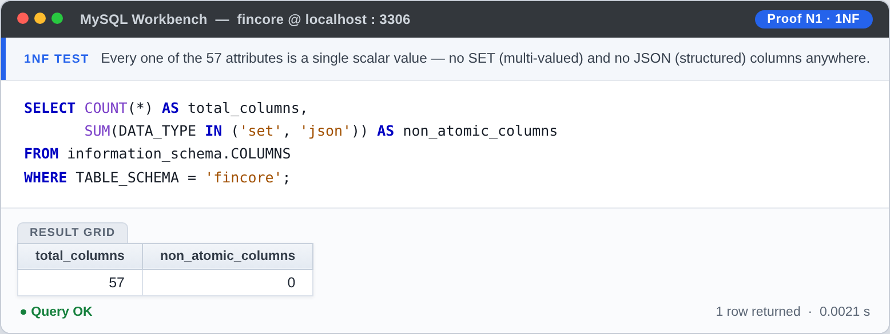
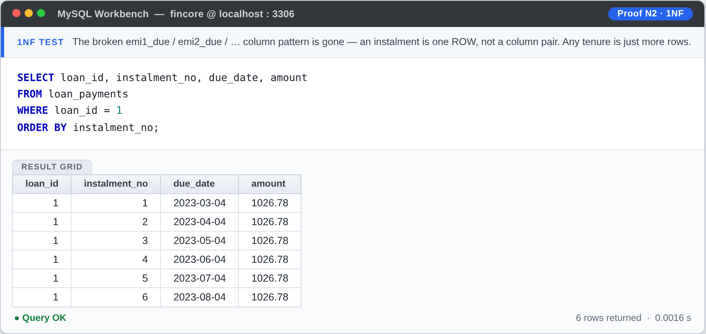
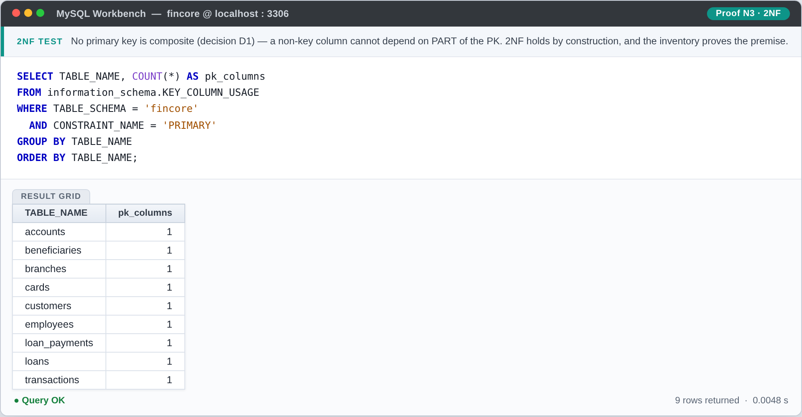
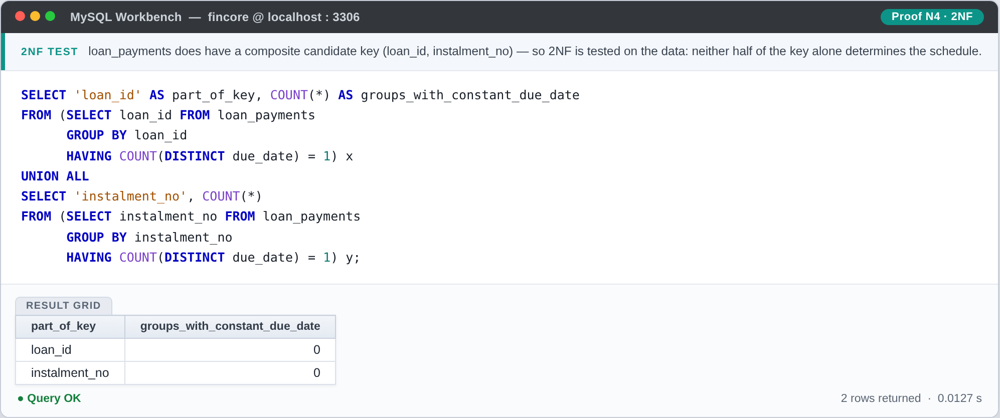
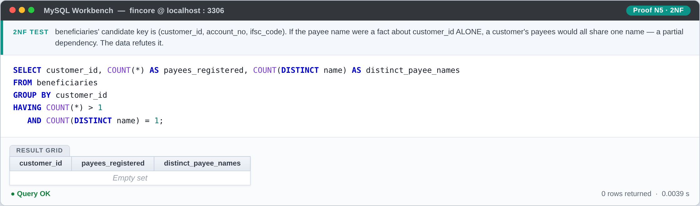
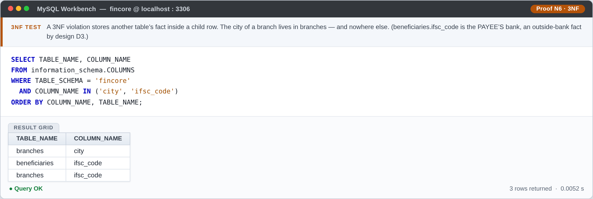
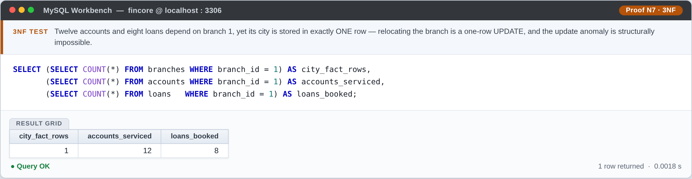
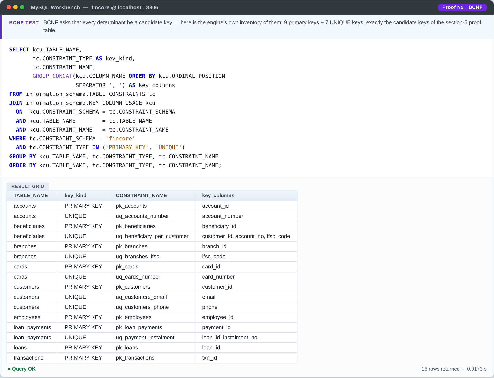
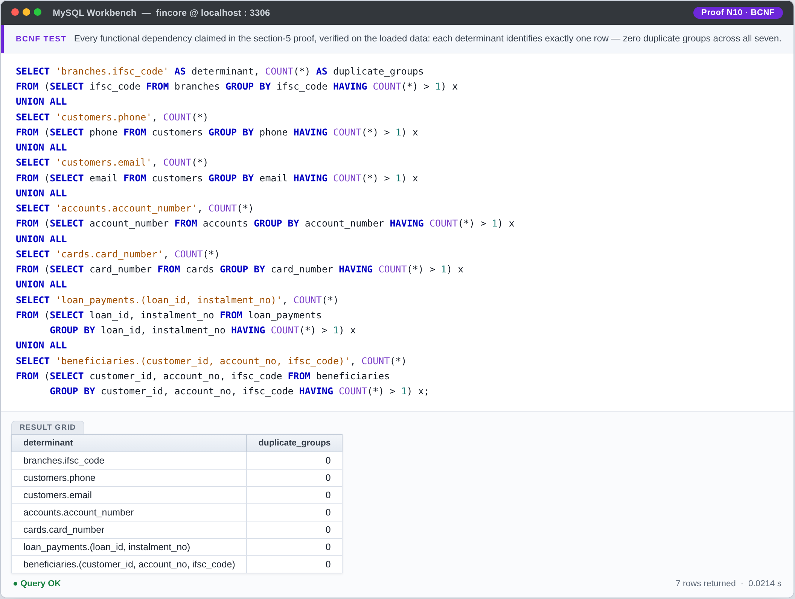
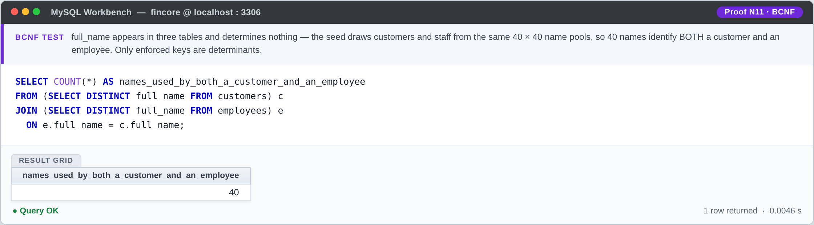

# FinCore — Normalization: From One Broken Table to BCNF

> Companion to [`DATABASE_DESIGN.md`](./DATABASE_DESIGN.md) · verified against
> [`schema/create_tables.sql`](../schema/create_tables.sql) (DDL v2.1)
> · executed as SQL in [`queries/normalization_proof.sql`](../queries/normalization_proof.sql) (§9)
> **Aryan Rao (AU25UG-006)** · cross-checked by **Amruta Nagavi** · Team 3, DBMS Project, Atria University

The design page (§6) gives the verdict — *all nine tables are in BCNF* — but a verdict
without working shown is just a claim. This document is the working: the definitions as I
apply them, a full 1NF → 2NF → 3NF → BCNF progression on a deliberately broken version of
the design, a BCNF decomposition exercise that actually changed the schema, the FD-by-FD
proof for all nine relations, and — because honesty is part of the discipline — the two
places I deliberately stopped short of purism, and why.

## 1 · Why normalize at all

Here is the table our team would have ended up with if we had just started typing `CREATE
TABLE` on day one — one row per loan, everything we knew stuffed in:

`lending_flat`

| customer_id | customer_name | phone | loan_no | branch_ifsc | branch_city | principal | interest_rate | emi1_due | emi1_amt | emi2_due | emi2_amt |
|---|---|---|---|---|---|---|---|---|---|---|---|
| 301 | Meera Nair | 9845012345 | L-17 | AUSB0000001 | Bengaluru | 500000.00 | 8.50 | 2026-01-05 | 12500.00 | 2026-02-05 | 12500.00 |
| 301 | Meera Nair | 9845012345 | L-24 | AUSB0000001 | Bengaluru | 200000.00 | 11.00 | 2026-01-15 | 8800.00 | 2026-02-15 | 8800.00 |
| 302 | Arjun Rao | 9901055566 | L-25 | AUSB0000002 | Mysuru | 300000.00 | 9.25 | 2026-01-20 | 9700.00 | 2026-02-20 | 9700.00 |

Three things are already wrong with it, and each one is a named anomaly:

- **Update anomaly.** The AUSB0000001 branch relocates from Bengaluru to a new city. That
  is *one* fact about *one* branch, but I must update rows 1 and 2 — and if I miss one,
  the database now claims the same branch exists in two cities at once. It hasn't been
  corrupted by a bug; it was wrong the moment I designed it.
- **Insert anomaly.** FinCore opens branch `AUSB0000003` in Hubballi. There is no loan
  there yet — so there is *no row* in which that branch can exist. A true fact about the
  world is unrepresentable until some unrelated event (a loan) happens.
- **Delete anomaly.** Meera closes both her loans. Deleting rows 1 and 2 takes her name
  and phone number with them — her entire KYC record dies with her last loan.

Every one of these is a symptom of the same disease: **one fact stored in more than one
place.** Normalization is just the cure for that disease, applied one layer at a time.

## 2 · The ladder — the questions I actually ask

| Normal form | The question I ask of every table | What it kills |
|---|---|---|
| **1NF** | Is every value atomic? Any repeating groups (`emi1_…`, `emi2_…`)? | sets and lists smuggled into rows |
| **2NF** | Does any non-key column depend on only *part* of a composite key? | partial dependencies |
| **3NF** | Does any non-key column depend on another *non-key* column? | transitive dependencies |
| **BCNF** | Is **every determinant** — anything that determines something — a candidate key? | the leftovers 3NF lets slip |

There is a mnemonic for the middle rungs that I have never been able to unhear, and it
genuinely works: every non-key column must depend on *"the key (1NF), the whole key (2NF),
and nothing but the key (3NF), so help me Codd."* BCNF tightens it to the strict version:
**every determinant must be a key** — no exceptions, not even for columns that happen to
be part of some key.

Two pieces of notation for the rest of this page: `X → Y` reads "X determines Y" (knowing
X fixes Y); a **candidate key** is any minimal set of columns that determines all the rest.

## 3 · The worked progression — `lending_flat` → four real tables

### 3.1 → 1NF: repeating groups out

The `emi1_due / emi1_amt / emi2_due / emi2_amt …` columns are a list wearing a disguise:
each row holds *a set of instalments* rather than one fact. And the disguise has a hard
limit — a 3-year loan needs `emi1` through `emi36` (72 columns), a 30-year tenure would
need 720. The schema would be capped by my patience for typing, not by the business.

**Fix:** one instalment per row, in its own relation keyed by `(loan_no, instalment_no)`:

```
loan_payments(loan_no, instalment_no, due_date, amount)
```

Any tenure is now just more rows. Note that this fix is *why `loan_payments` exists* — and
why the final schema backs its natural key with `uq_payment_instalment (loan_id,
instalment_no)` instead of trusting insert code to be well-behaved.

### 3.2 → 2NF: partial dependencies out

After 1NF, the loan table looks like this:

```
loans(customer_id, loan_no, customer_name, phone, branch_ifsc, branch_city,
      principal, interest_rate)          — key: (customer_id, loan_no)
```

`customer_name` and `phone` depend on `customer_id` **alone** — half the key is enough —
so they are partially dependent: a 2NF violation. Worse, once I write the FDs down
honestly, something bigger shows up: `loan_no → principal, interest_rate, branch_ifsc,
branch_city` — the *whole* rest of the row depends on `loan_no` alone. The composite key
was decoration; `loan_no` was doing all the work.

**Fix:** split by what belongs to whom —

```
customers(customer_id, customer_name, phone)
loans(loan_no, customer_id, principal, interest_rate, branch_ifsc, branch_city)
```

`customers` is now a table with a life of its own — Meera's KYC record survives even with
zero loans, which kills both the insert and delete anomalies from §1.

### 3.3 → 3NF: transitive dependencies out

Inside the 2NF-era `loans` sits `branch_ifsc → branch_city`: a non-key column determining
another non-key column. The city of a branch is a fact about the *branch*, and it is
currently stored once per loan — which is the update anomaly from §1, verbatim.

**Fix:** branch facts get their one home —

```
branches(branch_ifsc, branch_city)
loans(loan_no, customer_id, principal, interest_rate, branch_ifsc)
```

This is the same trap I was most careful to avoid in the final schema (design page §6):
the moment `branch_city` — or branch *anything* — appears inside a table whose key is not
a branch key, 3NF has been broken.

### 3.4 → BCNF: every determinant a key

The 3NF tables have exactly one determinant class left: their keys. In the final schema
this is true by construction in an even stronger sense, because of decision D1 (surrogate
keys): every relation's determinants are its candidate keys — the surrogate PK plus any
UNIQUE business identifier (`ifsc_code`, `phone`, `account_number`, …). No partial
dependencies exist because no primary key is composite (2NF holds trivially — I still
ran the check), and no transitive ones because every fact has exactly one home.

**Where this progression ended:** `lending_flat` decomposed into `customers`, `branches`,
`loans`, `loan_payments` — four of the nine real tables. The other five arrived the same
way: I wrote down each domain's facts, split by owner, and let the FDs dictate the shape.

## 4 · The BCNF exercise that actually changed the schema (loan_officer)

An early sketch of `loans` carried who handled the loan: `officer_name` and
`officer_branch` — "the loan officer and the branch they sit at", which sounded useful
for reporting. The FD that killed it:

```
officer_name → officer_branch        (each officer belongs to exactly one branch)
```

`officer_name` is a determinant, but it is not a candidate key of `loans` — BCNF
violation. (It fails the 3NF question too, as a transitive dependency — the point of the
strict BCNF test is that it catches such things without me having to classify them
first.)

**The decomposition:**

```
loans(loan_id, customer_id, branch_id, …, officer_id)     — officer_branch REMOVED
employees(employee_id, …, branch_id)                      — officer → branch lives HERE
```

`officer → branch` moves to a relation where it *is* key-based: `employees`, where each
row is one employee and `branch_id` is just another attribute of that key. And then the
follow-up question BCNF violations should always trigger — *does this fact even belong on
this table?* — had an honest answer: no demo query needs the loan↔officer link, so the
final `loans` carries no officer column at all. One decomposition, one scope decision,
and the schema came out simpler than the sketch.

## 5 · The proof — all nine relations, FD by FD

"→ all" below means "→ every non-key attribute of that relation" (full column lists live
in [`DATA_DICTIONARY.md`](./DATA_DICTIONARY.md)). Every claim in this table is also
**executed** against the seeded database — the queries and their results are in
[§9](#9--the-proof-executed--sql-and-results).

| Relation | Candidate key(s) | Non-trivial FDs | BCNF |
|---|---|---|---|
| `branches` | `branch_id` · `ifsc_code` | `branch_id` → all · `ifsc_code` → `branch_id` | ✓ |
| `customers` | `customer_id` · `phone` · `email` | `customer_id` → all · `phone` → `customer_id` · `email` → `customer_id` | ✓ |
| `accounts` | `account_id` · `account_number` | `account_id` → all · `account_number` → `account_id` | ✓ |
| `transactions` | `txn_id` | `txn_id` → all | ✓ |
| `loans` | `loan_id` | `loan_id` → all | ✓ |
| `loan_payments` | `payment_id` · `(loan_id, instalment_no)` | `payment_id` → all · `(loan_id, instalment_no)` → all | ✓ |
| `employees` | `employee_id` | `employee_id` → all | ✓ |
| `beneficiaries` | `beneficiary_id` · `(customer_id, account_no, ifsc_code)` | `beneficiary_id` → all · `(customer_id, account_no, ifsc_code)` → `beneficiary_id` | ✓ |
| `cards` | `card_id` · `card_number` | `card_id` → all · `card_number` → `card_id` | ✓ |

Four things to note about this table, because a checklist without commentary proves
nothing:

1. **The candidate keys come from the UNIQUE constraints**, not from hope. `phone` and
   `email` determine `customer_id` *because* `uq_customers_phone` / `uq_customers_email`
   exist — the FDs and the constraints are the same statement in two languages.
2. **The two composite-key relations were checked against both keys.** `loan_payments`
   and `beneficiaries` each have a surrogate key *and* a natural composite one; a BCNF
   violation can hide in either direction (the composite determining the surrogate, or
   part of the composite determining something), so both were run.
3. **The would-be determinants were checked too.** `full_name` appears in three tables —
   and determines nothing in any of them, because two people can share a name. "Looks
   unique" is not a functional dependency; only constraints make it one.
4. **`manager_id → …` is not a determinant issue.** The self-reference in `employees` is
   an FK (a value that *references* a key), not something that determines non-key
   attributes — `manager_id` determines nothing beyond what `employee_id` already does.

**2NF status:** holds by construction (no composite primary keys — D1), verified anyway.
**3NF status:** no non-key column in any relation depends on another non-key column —
each fact has exactly one home.

## 6 · Beyond BCNF: 4NF and 5NF, checked anyway

**4NF (no multivalued dependencies).** A 4NF violation needs an attribute that
independently holds a *set* of values per key — "customer 301 has phones {…} *and*
beneficiaries {…}" living in one table. FinCore has no such attribute: every column in
every relation is a single scalar fact, and every 1:N situation (customer→accounts,
customer→beneficiaries, account→cards…) is its own child table. The one genuinely
many-to-many situation — *transfers between two accounts* — is not a multivalued
attribute either; it is resolved inside `transactions` as two paired rows sharing a
`transfer_ref` (design page §5, D2).

**5NF (no join dependencies).** A 5NF violation requires a *cycle* of pairwise facts —
the textbook supplier–part–project triangle — where a table can be losslessly split into
projections and rejoined. FinCore's relationship graph has no such cycle by design:
`customers` and `branches` never connect directly; every route between them goes through
`accounts`, `loans` or `employees`, and those three-way combinations are facts about the
connecting table, not independent pairwise facts that could be projected apart. With
every fact stored exactly once (the 3NF discipline), there is no redundancy from which a
join dependency could be built.

## 7 · Where I deliberately stopped short (and why)

Normalization is a safety net, not a religion. Two deviations are on record:

1. **`accounts.balance` is stored, not derived.** Strictly, the balance is the sum of the
   account's transaction history (opened at 0.00, then deposits − withdrawals ±
   transfers), so a purist would derive it and never store it. I store it, as the
   *current truth*, because the cost of the pure version is a `SUM` over the account's
   entire history on every balance check — and because the stored value is maintained
   inside the same database transaction as the money movement, it cannot silently drift
   the way an unnormalizable cache would. This is controlled redundancy: a decision
   with a written-down reason, revisitable the day balances need to be event-sourced.
2. **Vocabulary lives in ENUMs, not lookup tables.** A `loan_types` lookup table would be
   one more normalized relation — but for seven frozen business vocabularies of 2–4
   values each, ENUM gives the same integrity guarantee (the engine rejects anything off
   the list) without a join. The trade-off and its boundary are argued on the design page
   (§5); it is the first thing to revisit if a vocabulary ever needs to grow at runtime.

The principle I actually operated by: **a deviation is allowed only if it is written down
with its reason.** An undocumented denormalization is a bug; a documented one is an
engineering decision.

## 8 · How this was verified, and the sync contract

- Every FD claimed in §5 was checked against the DDL's actual constraints (the UNIQUEs
  and PKs are what make determinants into candidate keys — see §5, note 1).
- The relation and key inventory matches the live schema: 9 tables · 57 columns ·
  7 UNIQUE keys (2 composite) — counts confirmed from `information_schema` after running
  `create_tables.sql`.
- Cross-references: relationships and ON DELETE actions → design page §2; column-level
  detail → [`DATA_DICTIONARY.md`](./DATA_DICTIONARY.md); the verification story
  (including the v2 corrections) → design page §7.

**Sync contract:** if `schema/create_tables.sql` ever changes a key, column or
constraint, this file must be regenerated together with `DATABASE_DESIGN.md` §2/§6,
`DATA_DICTIONARY.md` and the schema diagrams — the proof and the schema cannot be allowed
to disagree, even briefly.

## 9 · The proof, executed — SQL and results

Sections 1–8 prove the normal forms by hand. But this document's own first paragraph
sets the standard — *a verdict without working shown is just a claim* — and the same
standard applies to the proof itself. So the proof is also **executed**: eleven plain
SELECTs, one per claim, run against the database as loaded by
[`schema/create_tables.sql`](../schema/create_tables.sql) (DDL v2.1) and
[`data/insert_data.sql`](../data/insert_data.sql) (seed v1.1). The script is
[`queries/normalization_proof.sql`](../queries/normalization_proof.sql) — every query
carries its expected result in a comment — and the eleven screenshots below show that
output. The seed is deterministic (no `RAND()` anywhere), so a fresh run reproduces
every number exactly.

How to run it yourself:

```bash
mysql -u root -p < schema/create_tables.sql
mysql -u root -p < data/insert_data.sql
mysql -u root -p < queries/normalization_proof.sql
```

### 9.1 · First normal form

**Atomic domains (N1).** No attribute anywhere holds a set or a structure: of the 57
columns, zero are `SET` (multi-valued) or `JSON` (structured) types. Every value is a
single scalar — the schema-level half of 1NF, read straight from `information_schema`.



**No repeating groups (N2).** The other half of 1NF is the absence of the
`emi1_due, emi2_due, …` column pattern that §3.1 started from. Loan 1's schedule is
six *rows*, not twelve columns — any tenure is just more rows.



### 9.2 · Second normal form

**Single-column primary keys (N3).** 2NF violations require a non-key column
dependent on *part* of a composite key. Decision D1 (surrogate keys) means no primary
key is composite — the inventory confirms all nine are single-column, so 2NF holds by
construction.



**The composite candidate keys, tested anyway (N4, N5).** By construction is not the
same as checked, so the two relations that *do* have composite candidate keys were
tested on the data. For `loan_payments (loan_id, instalment_no)`: if `due_date` were
determined by either half of the key alone, some group would collapse to one date —
zero groups do. For `beneficiaries (customer_id, account_no, ifsc_code)`: if the payee
name were a fact about `customer_id` alone, some customer's payees would all share one
name — no customer's do.





### 9.3 · Third normal form

**One home per fact (N6).** A 3NF violation hides a parent's fact inside a child row
(`branch_city` inside `accounts` was §3.3's example). The scan shows where branch
facts may live: a branch's `city` exists in `branches` and nowhere else.
(`beneficiaries.ifsc_code` is the *payee's own bank* — an outside-bank fact by design
D3, not a copy of any FinCore branch row.)



**The update anomaly, measured (N7).** Twelve accounts and eight loans depend on
branch 1, yet its city is stored in exactly **one** row: relocating the branch is a
one-row `UPDATE`. In the §1 `lending_flat` table the same relocation meant editing
every loan row — and one missed edit left the database claiming one branch in two
cities. The anomaly is not avoided by discipline here; it is structurally impossible.



**Would-be transitive dependencies, refuted (N8).** 3NF needs a non-key column
determining another non-key column. The two candidates that could plausibly look
determining were tested on the data: `designation` does **not** determine an
employee's branch (every designation spans 50 branches), and `account_type`
determines neither the customer nor the branch (every type spans dozens of each).
Both refuted — no non-key → non-key dependency exists.


### 9.4 · Boyce–Codd normal form

**Every determinant is an enforced key (N9).** The BCNF test is *every non-trivial
determinant must be a candidate key*. This is the engine's own inventory of those
keys — 9 primary keys + 7 UNIQUE keys, exactly the candidate keys listed in the §5
proof table. §5 note 1 said the FDs and the constraints are the same statement in two
languages; this is that sentence, executed.



**The FDs hold in the data (N10).** Each determinant from §5 — `ifsc_code`,
`phone`, `email`, `account_number`, `card_number`, the two composite keys — verified
against the loaded rows: zero duplicate groups across all seven. Each determinant
identifies exactly one row, which is precisely what X → rest-of-row means.



**"Looks unique" is not a determinant (N11).** The mirror test: `full_name` appears
in three tables and determines nothing. The seed draws customers and staff from the
same 40 × 40 name pools, so **40 names identify both a customer and an employee** —
proof by lived example that a name cannot be a key, and that only constraints make
determinants (§5, note 3).



### 9.5 · Two honest notes for anyone probing further

Both notes are the same lesson: a functional dependency is a fact about *all possible*
rows, not a pattern in one load of data.

1. **Flat EMIs and flat product rates are seed properties, not schema rules.** Every
   instalment of a loan carries the same EMI amount, and every loan of a product its
   typical rate (all home loans at 8.50%). Nothing in the schema constrains either —
   a step-up EMI schedule or a negotiated 8.90% home loan is perfectly insertable —
   so `loan_id → amount` and `loan_type → interest_rate` are not FDs of these
   relations. "Looks determining in one instance" is exactly the trap N11 refutes.
2. **`accounts.balance` is stored, not derived** — the one documented, deliberate
   deviation, with its reason written next to it (§7).

The script, the screenshots and this section are part of the §8 sync contract: if the
DDL ever changes a key or constraint, `queries/normalization_proof.sql` and these
images are regenerated with everything else.
